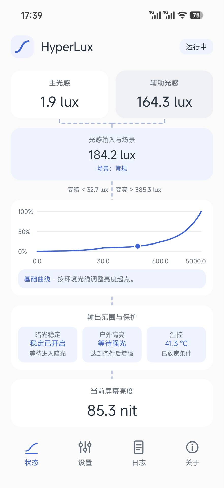
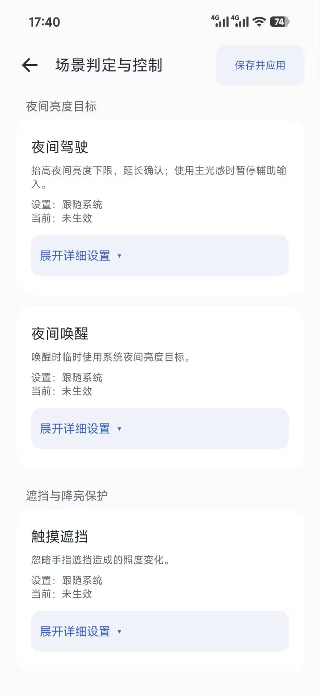
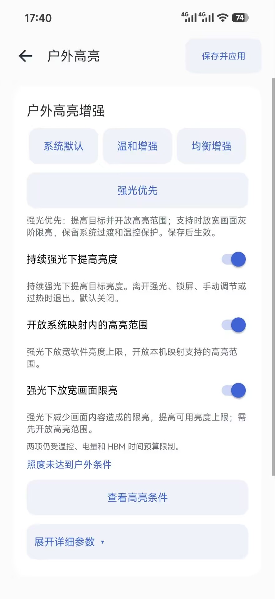
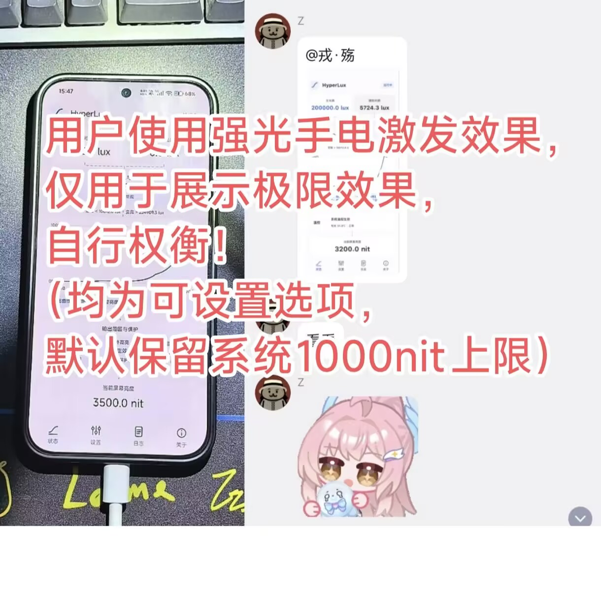

# HyperLux

**适配 HyperOS 4 的自动亮度工具。** 在系统亮度链路内调整曲线与手动偏好记忆，继续使用系统的双侧感光、场景判定和过渡动画；也可按需调整显示层温控与变化确认时间。

**3.0.0 正式版 / 30002** · Root + LSPosed · GPL-3.0 · 完全开源免费

已修复息屏清理、诊断和亮度重算中的风险，保留曲线、场景与已有配置。K90 偶发解锁卡死仍在排查；详见本版已知问题与验证范围。

[官网](https://lc.rongshangs.top) · [下载安装](https://github.com/RongShangs/LumaCurve/releases/latest) · [作者博客](https://rongshangs.top) · [酷安@戎Shangs](https://www.coolapk.com/u/3261403)

应用名称为 **HyperLux**，安装包为 `HyperLux-3.0.0.apk`。包名 `top.rongshangs.lumacurve`、蓝色曲线图标、官网及 `RongShangs/LumaCurve` 仓库继续沿用；源码与恢复包沿用 `LumaCurve-` 文件名。

## 界面预览 / Screenshots

<table>
  <tr>
    <th>状态页</th>
    <th>场景判定与控制</th>
    <th>户外高亮</th>
  </tr>
  <tr>
    <td></td>
    <td></td>
    <td></td>
  </tr>
</table>

### 用户强光效果示例

用户提供的强光手电演示，仅展示特定设备与设置下的效果，不代表日常亮度或所有机型的亮度上限。实际输出取决于本机映射、配置和系统保护。

<p></p>

## 3.0.0 正式版

当前构建 `release-3.0.0 / 30002`，提供正式 APK、源码与恢复包。保留原签名与配置，覆盖安装后重启。

- 状态页按光感、场景、曲线、输出保护和实际亮度重排；协调卡片高度与留白，场景直接蓝字点击，实际温控限亮或温度阻止户外高亮时，温度数值与单位标红。
- 九类现有场景支持参与方式、附加条件及进入/退出确认，页内展开编辑；设置分类、顶部保存和返回位置统一整理。
- 纳入 beta01 节点权限探测与两份 PR 的稳定性改进，修复记忆作用域、限亮证据及监听清理问题。
- 优化息屏清理、亮度重算和稳定光感事件开销，保留系统原采样率；加强 K90 故障分析包。
- 户外高亮主要开关按目标、范围、画面限亮排列；关于页加入测试贡献，原有名单数据保持不变。
- 更新支持忽略版本及官网/GitHub 下载；关于页标明正式版。

从 2.3.1 至今的完整变更见 [更新日志](docs/releases/3.0.0.md)。K90 已收分析包确认系统进程重启，但仍缺故障栈，根因与修复效果待目标设备验证；见 [专项排查](docs/reviews/2.4.0-k90-wake-20261010.md)和 [本版审阅](docs/review-3.0.0.md)。

## 2.3.1 更新

- 修复暗光锁定未收到有效感光回调的问题；使用系统显示控制器的传感器管理器，按类型与硬件标识匹配。
- 修复暗光阈值访问失败及明确夜间驾驶分支绕过暗光保护的问题，保留系统额外等待和亮度下限；日志补充实际阈值与错误。
- 新配置及“睡前保持”默认开启锁定：主辅均不超过 10 lux 持续 1 分钟进入，任一侧达到 50 lux 持续 1 秒恢复自动；已有配置保留。
- 手动面板自动识别明确的主屏节点，Java 与原生守护分别校验，权限恢复绑定节点身份。
- 修复保存等待期间新改设置被覆盖、暗光锁定转手动失败后自动亮度未恢复，以及接管确认丢失后的会话回滚；为守护健康记录增加有效期。

详见 [2.3.1 更新说明](docs/releases/2.3.1.md)和 [发布审阅](docs/review-2.3.1.md)。覆盖安装后重启，确认详细读数为 `release-2.3.1`。本版已完成主机回归及既有固件静态核对，尚无本版长期实机验证结论。

## 2.3.0 更新

- **自动强光优先**：全强度目标达到本机映射上限，开放已验证的高亮范围；支持时提前触发 HBM，保留原时间预算和系统保护。增强计时变化立即重算，不等待新光感事件。
- **主屏亮度磁贴**：控制中心打开独立弹窗，按相对距离拖动或输入节点值，也可选择节点最大值。实际操作后关闭自动亮度；关闭弹窗继续保持，锁屏 / AOD 暂停，解锁恢复，开启自动亮度结束接管。
- **统一弹窗布局**：数值右对齐，信息卡、滑条与操作栏协调，适配深浅色、安全区域及大字体；背景模糊和渐显随设备能力工作。
- **暗光定时锁定**：可选持续暗光后关闭自动亮度，低频监听主辅感光，持续变亮后恢复自动；默认关闭。
- **系统版本先检查**：明确检测到 OS3 等非 HyperOS 4 版本时直接提示不支持，避免误认为 LSPosed 没授权；属性读取失败或冲突另行说明。
- **温控阈值**：可调上限提高到 50℃，默认仍为 43℃，系统严重过热与驱动保护保留。
- **配置与诊断**：新增选项支持旧配置迁移，分析包补充主屏守护、写入 / 补写计数和交接状态；失败按具体阶段退让。

详见 [2.3.0 更新说明](docs/releases/2.3.0.md)与 [发布审阅](docs/review-2.3.0.md)。覆盖安装后重启一次；现有设置保留，新增强预设不自动开启。

## 2.2.0 更新

- **预设优先**：各分类先选方案，再按需展开详细参数；保留独立子页面、曲线图、主要开关与未保存提示。新增暗光、户外、确认、过渡和遮挡等预设，精简中英文说明。
- **系统深色模式**：页面、曲线、弹窗和按钮跟随系统主题，主题切换保留设置草稿。
- **手动记忆保存与锁屏恢复**：默认开启，按本机原生容量保存，可调整保留时间、数量与相近环境的恢复条件；新手动操作优先，恢复有限时，不反复覆盖系统环境重判。
- **暗光稳定加强**：主、辅助与微小变亮路径共享更严格的暗光门槛；可选辅助稳定闸门观察单侧变亮，缺证据或到时即放行，不修改光感值。
- **记忆交接可视化**：区分基础点、实时手动点、存档及短期模型，按设备能力开放锁屏重判和模型失效时间。保持四个基础编辑点，不强扩原生节点容量。

详见 [2.2.0 更新说明](docs/releases/2.2.0.md)。覆盖安装后重启一次加载新版 Hook；暗光稳定与辅助闸门默认不自动开启。

## 2.1.1 更新

- **修复保存失败与状态卡住**：拆分实时状态与运行记录，避免历史数据超过系统字符串长度限制；保留原有历史容量。
- **独立配置确认**：保存、停用和清除记忆不再依赖完整日志状态，核对当前系统进程与提交标识；重复通知保留手动锚点与暗光稳定。
- **完整失败提示**：核对是否恢复此前配置，保留未保存修改，弹窗展示原因并提供分析包导出。
- **更完整的诊断**：记录带快照标识，分析包包含配置确认与最近提交失败信息。

详见 [2.1.1 更新说明](docs/releases/2.1.1.md)。覆盖安装后重启一次，加载新版 Hook。

## 2.1.0 更新

- **户外高亮**：持续强光下提高自动亮度目标，可调整确认、强度、单次时长与冷却；按能力开放 HBM 触发、预算和系统高亮范围。全部默认关闭。
- **暗处亮度下限**：最左曲线节点支持上移，包括原始值为零的设备，保存与预设一并支持。
- **配置导入导出**：JSON 保存到设备存储根目录，可包含未保存修改；旧文件补默认值、按新范围调整，不同基准保留本机曲线。
- **设置独立子页面**：六组分类，参数直接显示，关闭自定义时置灰；引擎控制右侧显示红字未保存提示，跨页保留草稿。
- **更清楚的状态**：手动模式显示采样暂停，未确认有效的照度与阈值不再显示为零；补充户外目标、可用范围、HBM 与实际限亮记录。
- **页面过渡与布局**：淡入淡出、短距离横移，遵循系统动画设置；分类入口紧凑居中，返回图标无底框。

详见 [2.1.0 更新说明](docs/releases/2.1.0.md)；此前曲线机制研究见 [适配记录](docs/releases/2.0.4-test01.md)。新增高亮选项保留系统保护，不保证所有设备都能突破原有可见亮度。

## 2.0.0 更新

- 从 KSU 模块转为 Root + LSPosed APP，在 `system_server` 原显示线程内接入小米曲线，不再由 C daemon 和独立 Java broker 争取背光输出权。
- 完整的状态、设置、日志、关于四页界面，中英双语跟随系统；圆角弹窗、按钮内按压反馈及状态流水线。
- 图上拖动或输入数字编辑曲线，保存命名预设；调整手动偏好记忆强度与连续调节合并规则。
- 可选的显示层温控、普通亮暗及微小变亮确认时间，保留系统滤波、门限和过渡动画。
- Root、LSPosed、固件接口和旧模块检测，自动检查正式 APK 更新，导出分析包到手机存储根目录。
- 关于页依次展示简介与链接、交流群、打赏、感谢名单，作者位于最底部。

1.0.0 的模块源码及历史 Release 保留用于追溯。当前安装方法以本页和 2.3.1 APK 为准。

## 曲线与手动记忆

应用先核对主屏正在使用的实际控制器和默认映射，再选择小米 Refactor 或传统物理亮度映射（MIUI / AOSP PhysicalMappingStrategy）。不是按机型名称或单个资源开关猜测；未识别的接口保留系统控制并说明原因。

**默认值来自当前设备本地曲线，四个编辑点均为 100%。** Refactor 读取本机基础锚点；传统映射读取完整原始节点，在暗光、约 30 lux、约 600 lux 与末端设置四个编辑位置。编辑前三处，最低照度点还可独立提高亮度下限；末端保留本机原始上限；传统映射在 100% 时保持原数组，调整时保留原曲线的细节，不将密集节点压成四段直线。系统分类修正及曲线元数据继续保留。

- 直接拖动图上的节点或点击输入数字，提供柔和、系统默认、稍亮和自定义命名预设。
- 中间节点的名义强度范围为系统基准的 **10%～200%**；最低照度点可从当前基准向上调整亮度下限。实际范围受系统上下限、相邻节点和曲线单调性约束，界面显示可调范围。
- 系统手动亮度操作会在对应照度附近形成记忆锚点。可关闭记忆或降低强度；默认 100% 沿用系统行为。
- 较低强度下，连续调节合并间隔和照度范围控制同一手势的分组，避免一次拖动的多次回调重复累积。
- 「跨重启保留手动记忆」默认开启，可关闭；默认保留 30 天，可设 1～90 天。关闭保存不会清除系统当前偏好，清除手动记忆会同时删除实时点与存档。
- 亮屏恢复默认先等有效照度，核对锁屏前照度与存档点，只在相近环境恢复一次；新手动调整优先，环境变化不强行恢复。可选只补空缺或保留完整偏好，并调整容差与稳定等待。
- 基础曲线修改、用户切换与固件变化后旧存档不混用；Refactor 的原生总节点容量为 7，传统物理映射通常支持 1 个手动点。保存上限不增加基础编辑点。
- 「系统短期记忆」提供可选锁屏重判与模型失效时间；默认沿用系统，接口未识别时不可启用。计时到期不是立即删除曲线，系统在下一次有效照度下重判。
- 记忆页显示已应用基础曲线、系统当前曲线、实时与存档锚点，以及最近 16 次交接记录。

曲线坐标随实际机制变化：Refactor 使用 **OEM 逻辑亮度**，传统映射使用 **物理 nit**。手动记忆的输入也按对应映射转换，之后仍经过系统显示策略；曲线百分比不等于面板背光百分比或肉眼感知亮度。

## 双参考、场景与平滑过渡

主光感与辅助光感由 HyperOS 4 的 `DualSensorPolicy`、滤波、迟滞门限和场景机制处理。应用展示现有数据，采用哪一路参考由系统决定，不固定取前置，也不自行平均两路数值。

状态页串联「主光感 / 辅助光感 → 光感输入与场景 → 当前曲线 → 输出范围与保护 → 屏幕亮度」。传感器观测值与系统确认照度可以不同：尚未跨过门限时，系统会保持此前确认值。

点击状态页当前曲线卡片内的分支摘要，或日志页的「亮度分支」，可查看实际执行的曲线与输出路径，以及场景和手动保持是否改写了目标。变暗门限在中间虚线左侧、变亮门限在右侧。支持某个接口不等于它正在执行；记忆模型存在不代表当前曲线一定用了它，夜间策略开启也不代表本次改变了亮度。

被遮挡的一侧读到 **0 lux** 可以是有效暗光；**— / -1** 表示没有有效滤波值，不能当成 0。变化上报型传感器没有新事件，也不自动等于失效。手动模式下系统自动感光采样可能关闭，首页会说明采样暂停；先开启系统自动亮度再查看光感，不将无效的初始化零值当作暗光。

保留系统过渡动画、采样时间、滤波和变化阈值。普通亮暗及微小变亮的确认时间可独立配置，默认均关闭覆盖、沿用系统。它们调整的是接受持续变化前的等待时间，不直接设置面板动画速度；闲置与驾驶等额外策略仍沿用系统。

### 暗光稳定

设置 →「环境变化与确认」→「暗光稳定」→「保存并应用」。默认关闭，升级不会擅自开启。

已确认或候选照度在设定范围内时，增加主、辅助参考的最短变化确认。范围可设 **5～100 lux**，亮暗确认各可设 **1～4 秒**；默认值保持 **50 lux / 3 秒 / 4 秒**，保留更长的系统等待。主侧计入系统额外分段等待，并检查保留的采样窗口；新增等待受窗口限制，允许采用窗口内的部分延长；系统原有更长时间不缩短。辅助窗口保留 5 秒，不增加超过其窗口的等待。

该选项仅在自动亮度、亮屏且已有有效照度时参与；不覆盖手动调节、HDR、闲置和未知驾驶场景；明确识别的夜间驾驶场景保留原生额外等待和亮度下限。不伪造照度、不固定亮度、不改变温控和系统动画。它过滤短暂变化，持续输入波动仍可触发亮度调整。分支页显示主、辅助两条路径实际延长确认的次数。

暗光稳定卡片顶部可直接选择「暗光少动」或「暗光更稳」，保存后生效。前者设定变亮最小差 `max(60%, 10 lux)`、变暗最小差 `max(40%, 2 lux)`；后者进一步提高门槛。门槛仍取系统原有要求与设置中更严格者，并覆盖微小变亮路径；真正降到零仍能变暗。默认关闭该组功能，升级保留已启用的选择。

辅助闸门默认单独关闭；上述预设在本机支持时启用。暗处只有主参考变亮、辅助在最近有效历史内稳定时增加有限观察，少动预设为 6 秒、更稳为 8 秒。辅助被遮挡、无有效历史、过期或也发生变化时放行；主参考明显变亮或观察到时也放行，并短暂避免重复观察。不新增感光订阅，不平均或篡改两路照度，不能保证消除所有亮度波动。

预设只修改本组草稿，不改其他分类，也不会立刻下发。主要开关、图表与预设保持可见，详细参数默认折叠并记住展开状态。未保存提示同时支持触摸、键盘和无障碍开关操作。

## 户外高亮

设置 →「户外高亮」→ 开启「持续强光下提高亮度」并保存。默认关闭；默认 **10000 lux 持续 3 秒进入**、**30000 lux 达到设定全强度**，低于进入照度 **65% 持续 5 秒退出**，增强强度 **85%**，单次最长 **3 分钟**，冷却 **1 分钟**。强度描述的是向设备可用上限靠近的比例，不是固定增加 85% 或物理 nit 的保证。

增强接入系统目标链，在手动保持之后、最终范围限亮之前提高目标，不改基础曲线或手动记忆。自动亮度、正常亮屏与有效强光条件满足时才工作；手动选择、锁屏、HDR / 杜比、应用指定亮度、省电、特殊场景、温度或读数条件不满足时沿用系统。超时采用事件计时，不依赖光感连续刷新。

| 户外参数 | 可调范围 |
| --- | --- |
| 进入 / 全强度照度 | 2000～50000 / 4000～100000 lux，后者须大于前者 |
| 进入 / 退出确认 | 0.5～10 / 1～15 秒 |
| 退出照度比例 / 增强强度 | 40%～90% / 10%～100% |
| 单次最长 / 冷却 | 30～600 / 15～300 秒 |
| HBM 触发 / 预算倍率 | 0.25～1.5× / 1～2×，按本机支持情况开放 |

「调整自动 HBM 触发与预算」只支持实际使用计时且接口完整的设备。预算不超过系统原值两倍与原时间窗口，保留使用历史；零预算不当作无限时间。手动模式阳光屏的进入/退出确认是另一组选项，不等于自动 HBM 预算。

「开放系统映射内的高亮范围」按条件放宽软件范围，最高仍受设备映射、HBM 条件、HDR、画面限亮和驱动保护约束。不直接写驱动或面板，不保证所有设备都能获得额外亮度。亮度分支分别显示目标、可用范围、实际输出和最近限亮记录，目标升高不等于屏幕已经提亮。

### 基础曲线与当前记忆

曲线编辑页展示 **灰色系统默认曲线** 与 **蓝色基础曲线**，直接拖动蓝色节点或点击输入数值，保存并应用后生效；下方红字提示实际曲线还会受到手动记忆影响。

手动记忆页展示 **蓝色已应用基础曲线** 与 **浅绿色实际生效曲线**。浅绿线读取系统当前节点或实际映射采样，包含当前手动记忆；没有记忆时两线可以重合。浅绿色实点表示当前记忆、空心点表示已保存节点，存档只有恢复后才影响当前曲线。

状态页只显示 **一条实际生效曲线**：沿用系统默认时为灰色，自定义基础曲线为蓝色，当前记忆确实改变曲线后为浅绿色，不增加注释。三处曲线统一使用 2 dp 线宽并适配深浅色。未保存的基础修改和未恢复的存档不充作已经生效的结果。传统后端保留完整节点，特殊路径或数据缺失时说明未取得当前曲线。曲线表示亮度目标，温控、场景和户外增强仍可能改变最终输出。

记忆仍在独立页面设置，跨锁屏、跨重启开关和保存恢复规则保持原有逻辑。修改基础后系统可能重建记忆。

### 强光优先预设

户外高亮分类顶部选择「强光优先」并保存。全强度目标从均衡方案的 85% 改为 **100% 可用增强范围**，同时开放已验证的系统高亮范围；若本机使用可调整的 HBM 计时，把触发照度设为原值 **0.5 倍**，时间预算仍为 **1 倍**。仍采用默认 10000 / 30000 lux、3 秒进入、最长 3 分钟、冷却 1 分钟。缺少范围接口时说明不兼容，不套用残缺预设。

自动目标达到映射上限不等于必然达到手动节点直写的可见亮度。自动路径继续执行温控、低电量、HDR、HBM 预算与驱动限制；OPR / 画面限制可在已验证的强光 SDR 路径内按选项放宽，使用系统动画，不启用 C 守护。分支页可以区分目标升高与后续被限亮。

## 暗光定时锁定与主屏磁贴

「暗光稳定与锁定」定时锁定的新配置默认开启：主辅真实感光均不超过 10 lux 持续 1 分钟后，关闭本次自动亮度、维持当前值，系统进程继续低频监听；任一侧达到 50 lux 持续 1 秒后恢复自动。已有设置保留，可选择“睡前保持”后保存。进入 / 退出照度、等待分钟和退出确认时间可调。锁屏退出；不会恢复用户原本主动关闭的自动亮度。

「主屏手动亮度」可打开独立面板或添加控制中心磁贴。仅打开不接管；拖动、输入整数或点「节点最大值」才关闭自动亮度并直接控制自动识别并核对身份的主屏节点。上限读取本机 `max_brightness`，数值不是 nit，不写越界值，也不操作背屏。点击「恢复自动」或启用系统自动亮度结束接管。

小型 ARM64 C 守护仅在手动节点保持期间工作，持有句柄并在被覆盖时补写。已确认主屏接管时隔离系统正值亮度帧；锁屏 / AOD 释放权限暂停写入，正常解锁恢复选择，重新点亮的第一帧始终交给系统。自动、切换用户、停用或失联时取消目标；系统进程重启不自动恢复高亮。磁贴按实际接管显示激活，暂停显示解锁后恢复；关闭面板结束界面查询，继续保持选择。

不修改息屏、AOD、超时或唤醒设置，不使用唤醒锁。接口未识别或接管事务失败时保留系统控制。节点最大值与可见亮度并非等价，硬件与驱动仍可能限制效果。

## 设置与配置文件

设置首页保留引擎控制与九个分类入口，每个分类是独立子页面，有返回栏和底部保存按钮。预设与主要开关直接显示，详细参数按需展开；未开启自定义或接口不支持时置灰。红色「有未保存的设置」显示在引擎控制右侧和子页面保存区；切换页签、返回和切换分类保留修改，保存成功后清除提示。

「导出配置」将当前设置（包括未保存修改）写为 `/sdcard/HyperLux-config-时间-标识.json`。「导入配置」使用文件选择器，先预览调整结果，确认后加入草稿，再点击「保存并应用」生效。支持旧版本配置和文件：缺少新参数补默认值、范围变化调整并提示、不兼容选项关闭；曲线机制或完整基准不一致时保留本机曲线和下限。未知文件格式拒绝导入，不盲目套用另一设备的亮度坐标。

页签与子页面使用短距离横移和淡入淡出。系统关闭动画时直接切换；进入后台停止动画与前台状态读取。

## 温控

「减少温控降亮」默认关闭。开启后，仅在核对过的显示层调用期间暂时放宽热亮度上限，调用结束即恢复字段。电池温度未知、达到设定阈值或系统报告严重过热时，保留系统保护。

不修改 Thermal HAL、内核、驱动或温度数据。硬件、低电量和其他系统策略仍可能限制亮度，不保证任何温度下都不降亮。

## 安装与升级

需要 **HyperOS 4、Root、可用的 LSPosed**。APP 先读取 HyperOS 版本，OS3 等明确不支持版本直接提示；Android API 不是 HyperOS 版本。APK 最低 Android 14（API 34）；兼容以本机接口检测为准，不承诺所有 HyperOS 4 固件均已实测。

1. 安装 [`HyperLux-2.3.1.apk`](https://github.com/RongShangs/LumaCurve/releases/download/v2.3.1/HyperLux-2.3.1.apk)，无需在 KSU 中刷 ZIP。
2. LSPosed 启用 HyperLux，作用域选择「系统框架 / Android 系统」。**首次启用或更新 Hook 后重启一次**。
3. 启动 APP 并允许 Root，检查状态与日志页的连接情况。
4. 修改设置后点击「保存并应用」，后续调曲线和参数无需重启。

同包名、同签名的前版 APP 可以覆盖安装，保留设置和本地预设。旧测试 APP `top.rongshangs.lumacurve.refactor.test` 应取消 LSPosed 启用。

2.3.1 使用版本代码 **23106**，可覆盖同签名的此前正式版和本地测试版；旧版本可检测并提示正式升级。更新后重启一次，详细读数应显示 `build=release-2.3.1`。

APP 检测 `luma_curve`、`luma_curve_official_test`、`ios_auto_brightness` 等已知旧模块，提示卸载；停用或待更新目录也会显示。请在 Root 管理器卸载并重启，应用不直接删除文件。

## 页面与参数

| 页面 | 内容 |
| --- | --- |
| 状态 | 固定流水线、两路光感、确认照度、当前曲线、变化门限、温控、当前亮度与分支入口 |
| 设置 | 引擎控制、导入导出；亮度曲线、手动记忆、户外高亮、环境变化与确认、亮度过渡、场景与温控、运行状态与界面七组独立页面；预设优先，详细参数按需展开 |
| 日志 | 运行兼容概览、本次系统进程最近 160 条记录、亮度分支、详细读数和分析包导出 |
| 关于 | 简介及链接、交流群、打赏、感谢名单，作者位于最后 |

| 参数 | 范围 / 默认 |
| --- | --- |
| 曲线编辑 | 中间节点基准 10%～200%；最低照度点可上移，受相邻点与本机边界约束 |
| 手动记忆强度 | 可关闭；1%～100%，默认 100% |
| 手动记忆存档 | 默认开启，可关闭；保留 1～90 天，默认 30 天；点数 0 为自动，按原生容量处理 |
| 亮屏恢复 | 默认开启、仅相近照度恢复一次；容差 10%～200%（默认 50%），暗处最小 1～30 lux（默认 5），等待 0.5～5 秒（默认 1.5） |
| 锁屏记忆重判（可选） | 默认系统；起始 1～30 分钟，最长 1～120 分钟且不小于起始，照度差 1～200 lux |
| 短期模型失效（可选） | 默认系统；1～120 分钟，只影响新计时 |
| 连续调节合并 | 0.5～3 秒，默认 1.5 秒 |
| 记忆照度范围 | ±10%～50%，默认 ±30%；暗处至少 5 lux |
| 减少温控降亮 | 默认关闭；电池阈值 38～50℃，默认 43℃ |
| 温控冷却幅度 | 1～3℃，默认 1℃ |
| 普通变化确认 | 默认沿用系统；变亮 0.5～10 秒，变暗 1～15 秒 |
| 微小变亮确认 | 独立开关，默认沿用系统；0.5～15 秒 |
| 暗光稳定 | 默认关闭；适用照度 5～100 lux（默认 50），最短亮暗确认各 1～4 秒（默认 3 / 4），保留更长系统等待和采样窗口限制 |
| 暗光变化门槛 | 变亮比例 10%～300%、最小 1～30 lux；变暗比例 10%～90%、最小 0～10 lux；须开启暗光稳定 |
| 辅助暗光闸门（可选） | 默认关闭；观察 1～10 秒（默认 6），稳定容差 10%～50%（默认 20%），至少 2 lux；证据不足即放行 |
| 变化阈值（可选） | 正常亮暗 / 微小变亮各 0.5～3×；最低亮暗照度差各 0～10 lux；适用上限 10～2000 lux；默认关闭 |
| 辅助确认（可选） | 变亮 / 变暗 / 微小变亮各 0.5～4 秒；默认关闭 |
| 过渡动画（可选） | 自动亮 / 暗过渡时长倍率各 0.5～3×；默认关闭 |
| 手动阳光屏（可选） | 进入确认 1～8 秒、退出确认 0.5～8 秒；默认关闭，不修改自动 HBM 冷却和预算 |
| 触摸遮挡（可选） | 移开后等待 0～5 秒，整数秒；默认关闭，仍在遮挡区时保留保护 |
| 状态刷新 | 1～5 秒，默认 2 秒，仅影响前台显示 |

高级组只在本机接口支持时开放。阈值倍率越大越不敏感，动画倍率越大过渡越慢；保持系统感知坐标，不是物理亮度的线性速度。主 / 辅助确认与暗光稳定同时开启时保留更长等待，但新增等待仍受采样历史限制。HDR、闲置、驾驶等条件按对应保护规则沿用系统，手动阳光屏仅作用于手动模式。

实时状态与历史记录分开传输，分片限制大小并核对快照；配置确认使用独立字段，不受日志长度影响。日志外层固定，记录窗口可滚动；自动滚动默认开启，关闭后保留阅读位置。分析包导出到 `/sdcard/` 根目录，八步进度，不自动上传。包含状态、配置、应用记录、曲线与输出追踪、显示、sensorservice、power、温控、电池、固件标识、显示配置、资源覆盖和相关系统/小米框架。亮度 Settings 通过已有 SettingsProvider 接口读取主用户 0，保留原始字符串；`settings/system.json` 和三项文本区分有效零值、未设置与读取失败。附 `collection-manifest.json`，记录缺失、失败、超时、截断与文件 SHA-256；流式压缩，完成 ZIP 校验才提示成功。各资料按顺序采集，并非同一时刻的快照。单文件最多 64 MiB，复制文件总计最多 256 MiB、256 个文件；命令输出每项最多 2 MiB，总体采集预算 180 秒。框架只用于私下诊断，不随公开源码或网站分发。

2.0.1 新增 `pipeline-trace.json`（最近 24 次曲线计算）、`output-trace.json`（最近 16 次不同输出记录）及 `trace-readme.txt`。同一计算按序号关联各阶段；后续显示修正独立记录，不当作同一时刻的调用。框架亮度 0～1 坐标不等于 nit 或面板背光百分比。未观察到的阶段保留空值，不补成“关闭”。追踪只保留有界内存记录，不持续写文件、不增加传感器订阅。

## 占用与验证

自动曲线 Hook 在系统显示线程内按事件工作，没有独立 Java broker。**手动主屏节点保持期间才启用小型 C 守护**；暗光定时监听位于系统进程，不使用 C 进程。前台读取复用 Root 连接；后台关闭连接和状态动画。

当前架构的内存、CPU 增量尚未完成独立实测。旧模块的 30 MB / 0.02% 或 65～71 MiB / 1.26% 均不能套用到本 APP，整个 `system_server` 占用也不等于 Hook 增量。

用户已确认此前 Refactor 曲线调整有效；辅助光感在既有采集中贴桌为有效 0，拿起后在锁屏前自行恢复。这只代表当次设备和场景，不能保证所有场景均不会失效。

2.3.1 构建执行生产曲线、记忆、配置迁移、预设隔离、暗光策略、输出 Hook 回调、原生节点租约与事务、计时增强和状态传输回归；核对三份已有固件的 HBM 与动态范围链路，并验证原生载荷、APK 签名与对应源码一致性，补充保存期间草稿保护、接管回滚及守护健康记录检查。网站部署另行进行。详细结果随源码中的构建验证记录提供。主机模型和静态检查不能替代本版长期实机验证，不承诺具体 nit 或消除所有波动。

## 更新与恢复

系统 fingerprint、实际曲线机制或完整基准变化后，不继续套用旧配置，恢复系统基准并提示重新核对。接口字段或签名不成立时保留系统控制、禁用不兼容功能。系统更新可能改变隐藏接口，请更新后重新检查。

进入 APP 和关于页自动查询本仓库最新正式 Release，发现更高版本提示下载。仅接受本仓库正式 Release 的 `HyperLux-版本.apk`（兼容旧 `LumaCurve-版本.apk` 命名），忽略预发布及旧 KSU ZIP，不静默安装。官网提供相对路径 APK 和源码，域名保持 `lc.rongshangs.top`。

设置 →「停用并恢复」等待系统确认；也可在 LSPosed 取消勾选并重启。完整 ZIP 是 **APK、对应源码和恢复工具合集，不是 KSU 模块**。解压后在同一目录执行：

```sh
su
sh ./restore_refactor_hook_android.sh
```

恢复工具先停止主屏守护、恢复原节点权限，再提交停用请求；此前被本应用暂停的旧 KSU 引擎须另行核对暂停状态。

## 源码与构建

当前源码位于 [`experimental/refactor_hook/`](experimental/refactor_hook/)，目录名保留开发历史。

```powershell
python tools/build_refactor_hook_test.py --skip-device-fixtures
python tools/sync_website.py
python tools/package_website.py
```

需要 JDK 17、Android SDK 37 / Build Tools 37.0.0、NDK 28.2.13676358 和 Xposed API 82。静态 ARM64 原生守护随构建打包。SDK 路径可按本地环境调整，编译依赖校验 SHA-256。没有私有固件资料时使用 `--skip-device-fixtures`，仍运行主机检查和运行时接口检测；有资料时去掉参数核对消费链。

自行构建使用自己的本地签名，不能覆盖维护者签名的 APK。源码和发行包不包含签名私钥、设备采集资料或小米固件。

| 目录 | 用途 |
| --- | --- |
| `experimental/refactor_hook/` | 当前四页 APP、Hook、曲线与逻辑检查 |
| `tools/build_refactor_hook_test.py` | APK、源码和恢复包构建 |
| `tests/refactor_hook_firmware.py`、`tests/refactor_traditional_firmware.py` | Refactor 与传统映射的固件接口、消费链静态核对 |
| `website/` | 静态官网、相对路径下载与版本信息 |
| `module/`、`csrc/`、`experimental/framework_output/` | 1.x 模块历史实现 |

## 支持与感谢

完全开源免费，遵循 [GPL-3.0](LICENSE)。打赏自愿，APP 内支持微信、支付宝。欢迎捐赠 2.3 元，备注「昵称：想说的一句话」，总计不超过 30 个字符，将会尽快更新到感谢名单。

QQ 交流群：**314981836**，暗号：**1691**，APP 点击复制仅复制群号。

发布说明遵循 [发布约定](docs/release-policy.md)，感谢名单变动仅更新名单本身。

### 感谢名单

官网与 APP 共用 [`website/thanks.json`](website/thanks.json)。后续只需更新服务器根目录的 `thanks.json` 中 `entries` 的 `name` 与 `message`，网页刷新和 APP 进入关于页即可读取，无需重新发布 APK。APP 联网失败时显示缓存或随包名单，每次进入至多一分钟刷新一次。`thanks.js` 为本地 `file://` 预览兜底，由网站同步工具生成；只在本地预览时修改 JSON 后重新运行同步工具。


- 戒戒：喵喵喵？
- Starshine：好歹露个脸
- H*P：感谢发电
- *意：[未填写]
- *弎：[未填写]
- Albert_L：能露点什么呢🤔
- 立秋：感谢开发，感谢适配k90pm
- GIVEFnI：芜湖
- *🥜：请坚持下去
- Msk包子：感谢制作
- 吾心之铭：我喜欢你
- 全民制作人：[未填写]

作者：[戎Shang](https://rongshangs.top) · [酷安@戎Shangs](https://www.coolapk.com/u/3261403)
