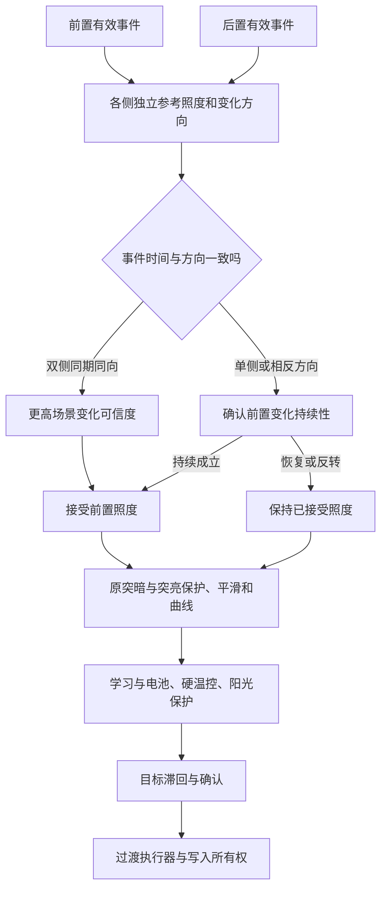

# iOS 亮度研究与双光感场景自适应

研究日期：2026-09-29。实现属于 LumaCurve 0.0.1 的维护改动，原曲线、硬温控阈值和 GPL-3.0 保留。公开资料只能支持设计思路，不能据此宣称复刻 iOS 私有算法。

## 公开资料与结论

- [Apple 自动亮度说明](https://support.apple.com/en-gb/109351)：照度变化用于亮度调节；True Tone 是另一个显示调节功能；过热可限制最大亮度。该说明不公开曲线和滤波系数。
- [iPhone 14 Pro 官方规格](https://support.apple.com/en-za/111849)：明确列出双环境光传感器。不能推广成所有 iPhone 都采用同一传感器结构。
- [Apple 多环境光传感器专利 US11594199B2](https://patents.google.com/patent/US11594199B2/en)：讨论正面与补充光感的条件选择，以及由正面读数约束背面输入产生的亮度。专利是公开设计方案，不是已验证的 iOS 源码。
- [Apple 自适应显示专利 US9947259B2](https://patents.google.com/patent/US9947259B2/en)：讨论结合设备方向调整多光感的使用。当前工程没有可靠姿态输入，本轮不新增陀螺仪、摄像头或采样线程。
- [AOSP 光感类型定义](https://source.android.com/docs/core/interaction/sensors/sensor-types#light)：标准 Light 传感器采用 on-change 上报，照度单位是 lux。没有新事件不等于传感器故障。
- [NDK 传感器接口](https://developer.android.com/ndk/reference/group/sensor)：ASensor_getReportingMode 可查询上报模式。只使用运行时确认的模式，不把厂商背面传感器当成标准前置光感。
- [AOSP 自动亮度控制器的历史源码](https://android.googlesource.com/platform/frameworks/base/%2B/60aae16/services/core/java/com/android/server/display/AutomaticBrightnessController.java)：展示了时间历史、亮暗滞回和确认调度的架构。作为独立实现的设计参考，不把历史分支参数描述成当前 Android 或 iOS 的参数。

据此作出的工程推断是：正面决定通常使用的照度，背面提供变化一致性证据；先判定输入可信度，再进行曲线映射和输出过渡。双侧共同变化增加场景切换的可信度，但不是场景变化的绝对证明。

## 对原维护策略的修正

上一轮 indoor_stability 只作用于 100 lux 以下、普通目标的中等波动，背面基本仅用于前置失效后的备用输入。新的策略覆盖全部有效照度范围，并在原突暗/突亮判定之前确认单侧变化。

配置键继续使用 `indoor_stability`，防止旧配置和保存表单冲突；设置页名称改成「场景自适应」。值 1 开启，值 0 关闭整个新增策略，包括 on-change 安静有效性判断。缺失键和配置重载的行为维持上一轮约定。配置协议仍是 11。

这张图描述普通亮屏自动路径。前置不可用时仍走备用确认；手动、息屏、接近遮挡和唤醒只读等路径继续由原所有权流程控制。

## 输入变化判定

每一侧都有独立参考值。比较 `log(1 + 当前照度) - log(1 + 参考照度)`，避免正背面安装方向、透光率和绝对读数不同导致误判。不会直接取双侧最大值，也不会将双侧照度平均成输入。

当前固定参数是本工程的可解释初值，不是 Apple 参数，也尚未经过设备群体标定：

| 条件 | 初值与处理 |
| --- | --- |
| 原始输入范围 | 有限值，0–200000 lux；原 NDK 顺序与无效计数规则保留 |
| 光感关系变化 | 绝对变化至少 0.5 lux，且 1+lux 的变化比超过约 1.2 倍 |
| 已接受前置照度的死区 | 绝对变化不足 0.5 lux，或 1+lux 的变化比不超过约 1.1 倍时保持 |
| 双侧同期 | 两侧变化起点、最新事件时间的偏差分别不超过 1500 ms |
| 双侧幅度一致性 | 同方向，较大对数变化不超过较小变化的 4 倍 |
| 单侧变亮 | 约 2000 ms 持续确认 |
| 单侧变暗/相反方向 | 约 3000 ms 持续确认 |
| 普通上报模式 | 单侧确认至少两个真实独立前置事件；不通过重复读取增加计数 |
| 已确认 on-change | 一个有效事件持续经过确认时间即可，不声称取得了第二个样本 |

双侧共同变亮/变暗直接送入原平滑过程，不绕过曲线和执行器。接受一次变化后，更新双侧参考值，防止过去的背面闪光污染下一次场景判断。单侧变化恢复到参考附近会撤销确认，避免手指短暂遮住正面就快速降亮。

| 观察到的变化 | 关系字段 | 处理 |
| --- | --- | --- |
| 双侧基本稳定 | stable | 保持输入死区，抑制细小目标波动 |
| 前后同期同向变亮/变暗 | common_rise / common_fall | 更快接受前置读数，后置仅提供证据 |
| 前置单独变化 | front_only | 延时确认后接受；不因后置静止而永久拒绝 |
| 后置单独变化 | back_only | 正面优先，后置手电筒不拉高前置输入 |
| 前后同期反向 | divergent | 暂不当成全局场景变化，确认前置持续性 |
| 缺少可靠双侧数据 | single | 退化为单侧与原保护路径，仍有全照度目标确认 |

没有可靠方向传感器时，无法严格区分设备旋转、定向光源和遮挡。共同变化也可能来自共同遮挡，原接近检测仍然优先。没有增加姿态估计、采样频率或线程。

## 上报模式与事件年龄

初始化时动态查找 `ASensor_getReportingMode`，分别查询成功启用的前后传感器；不改变恢复工程的 IosState 布局。只有查询成功、模式值确认为 1、传感器已启用且存在正时间戳的有效事件时，安静的旧照度才可继续有效。

其余模式或符号缺失保留约 8 秒事件年龄检查。真实时间戳仍保留，页面详细读数中 on-change 的年龄标成「距最后变化」；不会每次循环改时间戳、增加样本数或伪造新事件。关停、唤醒重新启用、配置成功重载和进程重置都会清理场景历史。

前置失效后，连续或未知模式的后置仍需要两个独立样本；确认是 on-change 的后置可以用一个有效样本持续满 1000 ms 确认备用输入，真实计数仍为 1。

仅凭静默无法区分正常 on-change 与 HAL 静默故障。当前没有添加周期性重新启用传感器的耗电行为，也不声称检测了所有 HAL 故障。唤醒启用和无效事件保护继续保留。

## 变化上报下的时间推进

原平滑与部分保护逻辑只在新的光感事件进入时推进。只修正静默有效性会让单次变化后的平滑值停在半途，因此在确认 on-change 模式下增加控制边界的时间推进，仍使用原配置的快、中、慢 alpha。用 `1-(1-alpha)^(实际间隔/1000)` 折算权重；限制一次计入的间隔不超过 10 秒，收敛时结束微小残差。

新的事件先运行原事件处理，本路径不再重复滤波一次。没有新事件时，只推进已接受输入的平滑值，不移动前后事件时间戳，不插入趋势样本，也不增加突暗计数。暂停、只读、过期、单侧仍待确认时停止推进。

已确认 on-change 的零照度候选持续约 3500 ms 后可退出怀疑状态；低照度突亮候选持续约 6000 ms、且仍与记录的候选一致后允许受限升亮。只使用真实候选样本数，单次上报仍记 1，保留原有限升亮上限和退回窗口；不会伪造可信突暗或直接激活 HBM。原始候选本身仍需先经过单侧 2–3 秒的场景确认，因此这些时间会叠加。

测试分别检查 250 ms 四次与 1000 ms 一次的固定 alpha 时间等价、单调有界收敛、计时回退、旧事件数保持，以及候选到期边界。完整主循环另验证一次上报后的持续亮度变化、低照度上升和全暗最终能继续收敛。

## 输出确认与保护边界

时域目标确认由原来低照度限定扩展到所有有效照度：普通目标差异不超过约已保持亮度的 5% 时保持；新的独立事件进入最多 7 项的固定数组，达到确认时间后取中位候选，再进入原目标防抖与限步。

普通中等变化继续采用至少 3 个真实事件、变亮约 3000 ms/变暗约 4000 ms。双侧证据或已通过前置确认时，在同方向的短期窗口内缩短新增目标确认至约 1000 ms；连续模式至少 2 个事件。确认 on-change 后可按持续时间确认一个候选，不虚构计数。

这里的 1–4 秒是新增确认阶段，不是最终屏幕达到目标的总耗时；还会叠加原滤波、1800/3000/1200 ms 分支防抖、限步和执行器过渡。环境稳定时的明显初始目标差距仍保留原大变化响应。

硬温控、已激活的阳光增强、原可信突暗、唤醒保护和所有权等旁路优先级保留。场景确认不会把背面照度直接送入阳光触发。在温控/阳光已生效和退出清理场景，测试继续要求完整控制轨迹一致。

## 诊断与维护入口

开启时状态文件额外输出：

- scene_relation：最近主控制边界的关系分类。
- scene_hold_active / scene_hold_left_ms：单侧确认是否活动和时间剩余。时间到但普通模式仍缺独立样本时，active 仍为 1、剩余为 0。
- scene_confirm_samples：单侧候选的实际前置样本数；共同变化不使用此计数。
- front_reporting_mode / back_reporting_mode：NDK 查询结果；-1 未确认，0 连续，1 变化上报，2 单次，3 特殊触发。

状态页的滤波节点显示「单侧确认中」「环境变亮/变暗」「正面优先」等实际关系。原始照度仍保留在前后节点中，处理后的业务输入仍由 lux/smooth 展示。

生产改动集中在 `csrc/business_debounce.c` 和 `csrc/scene_adaptation.h`，NDK 事件经 `poll_sensors.c` 按顺序进入历史；`main_business.c` 普通自动采集完成后调用过滤，暂存时跳过原照度历史更新，确认后才进入突暗与平滑。没有另建不被主循环调用的实验 helper，也没有重跑反编译生成器。35 个显式生产 C 文件和恢复 ABI 保留。

## 验证与实机复核

受控主循环验证：关闭策略的 37 个旧场景、默认配置的 38 个场景、额外 12 个双光感/模式场景；这些是维护 C 与固定旧 C 的 IO 回放，不是这次再次对原 ARM64 ELF 的全量差分。

核心可靠性测试包含单侧遮挡取消、持续前置变化、双侧亮暗、不同量纲、异步起点、同批次但事件时间不同、相反方向、上报模式、真实计数与重置。9 个独立破坏版本必须正常编译后被语义断言拒绝。已有设置/传感器顺序/状态短写/观察订阅的 4 个负向继续运行。

状态文本原字段在关闭新增策略时仍做 100 次逐字节旧实现比较；开启时额外诊断分别检查。保护路径的比较只移除明确列出的新增诊断行，其余字段和完整控制轨迹继续比较。

Android 实机未连接到当前环境。建议按室内坐定、前后单独遮挡、背面手电、进出门口、旋转手机、持续阳光和息屏唤醒观察；保存原始状态和日志，查看实际 front/back 上报模式、事件年龄、scene_relation 和写入所有权。

此前日志中的 external brightness sync 仍可能表示系统或其他服务修改背光。本轮场景过滤无法约束其他写入者；若变化仍频繁，应结合 last_write_result、write_readback_mismatch_streak 和 brightness_owner 继续定位。耗电、传感器身份/校准和实际舒适度不能由主机回放替代。

## 本轮验收记录

本轮受控事件回放的输入变化发生在启动只读窗口之后，各新增场景记录 300 个等待边界。背面单独从 40 lux 升到 10000 lux 时，前置目标、候选、平滑和实际业务照度的控制轨迹与稳定对照完全相同。短暂前置遮挡未进入原可信突暗；一次上报后的变亮、全暗和低照度上升均完成时域确认并继续收敛。

验收结果：37 个旧配置场景（36 个完整匹配，1 个此前已声明的后置可用修正）、38 个默认配置场景、12 个新增完整主循环场景通过；核心可靠性 9 个独立语义破坏版、既有 IO 优化 4 个语义破坏版全部检出；WebUI 36 项、安装兼容 11 组与安装流程 16 项通过。

受控场景 front_only_rise：首次业务照度接受距输入变化 3000 ms。这是控制边界观测值，不是屏幕达到目标的总时长。

受控场景 paired_rise：首次业务照度接受距输入变化 1000 ms。这是控制边界观测值，不是屏幕达到目标的总时长。

受控场景 onchange_front_rise：首次业务照度接受距输入变化 2000 ms。这是控制边界观测值，不是屏幕达到目标的总时长。
