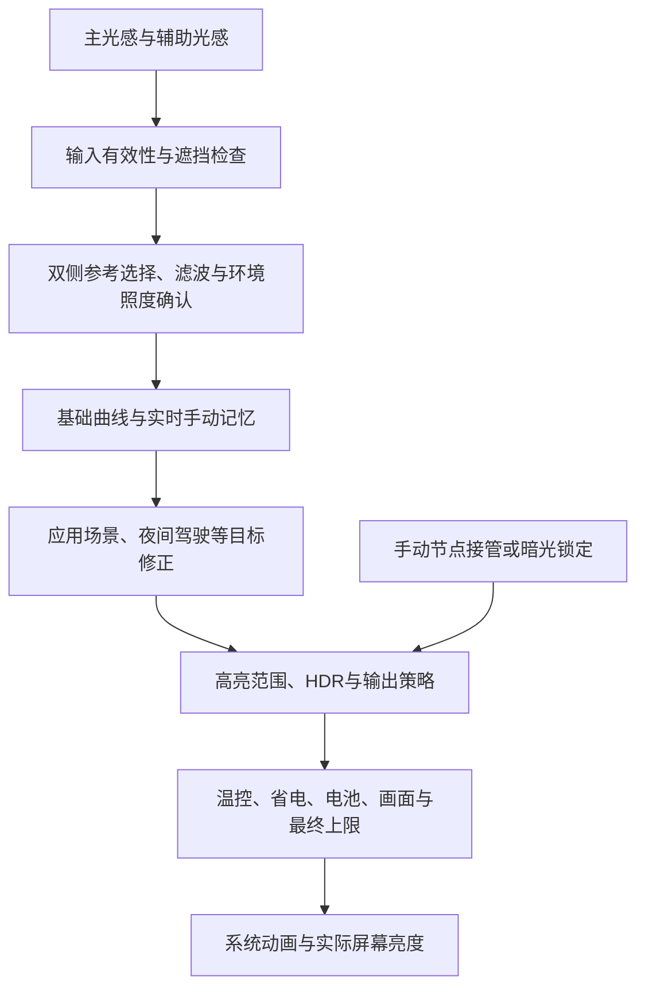

> 当前 r11 补充：现有场景改为页内展开，进入与退出确认分别设置；旧 `confirm` 同时回退两者。详见 [r11 修订](2.4.0-inline-scenes-20261010.md)。

# 2.4.0 亮度机制、场景与设置重排

构建：`release-2.4.0-r10 / 24010`。本轮依据项目实际钩子、两套本地 OS4 框架反汇编和连接手机的只读 ADB 状态核对。默认场景策略全部跟随系统，旧配置没有场景字段时保持原行为。

## 亮度如何从光感走到屏幕

这张图表达依赖关系，具体调用次序以各固件消费者为准。夜间驾驶同时参与输入有效性、确认时间和目标下限，不能只放到最终限亮中；温控和功率保护主要作用于输出上限，不能称为光感识别场景。

1. **输入**：主、辅助传感器先经过各自缓冲与有效性判断。普通距离、触摸遮挡可以使照度事件不被采纳；相机、手电等会影响辅助事件。传感器存在不等于当前参与计算。
2. **融合与确认**：系统选择当前参考照度。显示的融合照度不是简单平均数；主辅值相差大也不必然是错误。变亮/变暗阈值、确认时间、步行延迟、AON 与流式距离会决定何时接受变化。
3. **曲线**：系统 Refactor 或传统映射提供本机基准，基础曲线调整映射起点；实际生效的手动偏好改变附近照度目标。存档、开关和实际学习曲线分开表述。
4. **目标修正**：前台应用策略、夜间驾驶下限、上游夜间唤醒目标可修正曲线输出。曲线算出的亮度不能直接当作面板最终亮度。
5. **输出归属与范围**：自动、临时、应用指定、手动、暗光锁定、息屏显示等有不同归属。自动 HBM、手动阳光屏和 HDR 是不同链路。
6. **最终保护**：实际温控、省电、电池、画面灰阶、HBM 时间预算、输出范围和驱动上限继续生效。开放映射内高光范围不保证突破所有后续上限。

## 状态页怎样对应这条链路

从上到下是：主/辅助读数 → 光感输入与场景 → 当前实际曲线 → 输出范围与保护 → 实际屏幕 nit。

- 光感区域显示当前场景。弹窗按生效/其他分组，自动定位首个生效项；每项只保留简短效果与状态，一个底部场景设置入口。
- 曲线下蓝块只显示一行当前曲线说明，基础/已学习/系统曲线各自对应；设置名为蓝色链接，没有亮度分支入口。
- 输出范围与保护固定横排暗光稳定、户外高亮、温控。每栏包含状态、简短说明和设置箭头，未知或过期也明确显示，不留空白。
- 完整亮度链路仍在日志页“亮度分支”中，七组详细读数用于诊断。
- 普通字体下主辅/实际亮度 64 dp、光感与场景 80 dp、曲线蓝块 32 dp、输出保护卡片 120 dp，常规间距 12 dp、阈值行 28 dp。相同窗口与字号下高度固定；大字号按公式扩展，短屏整页滚动。

## 九类可控制场景

每类提供“跟随系统”“不参与亮度控制”“满足条件才允许”。第三种只增加准入条件，原系统条件仍须成立。接口或机型策略不支持时显示原因，只允许恢复系统，不伪装可用。

| 场景 | 系统触发与退出 | 对亮度的实际影响 | 用户可控制部分 |
| --- | --- | --- | --- |
| 夜间驾驶 | 驾驶传感器识别为驾驶，当前在系统日落之后或日出之前，且机型允许驾驶亮度策略；驾驶识别结束或白天退出 | 主光感参考时重置/忽略辅助事件，使用夜间下限并增加确认；用户手动调低后系统可不再强抬下限 | 是否允许进入；附加时间、照度、遮挡条件。保留物理驾驶识别原值，切换时通过原入口重新确认 |
| 运动延迟 | 系统步行检测收到步行事件，每次事件续期；超过本机有效期退出 | 增加降亮确认时间，不替换基础曲线 | 是否应用步行额外确认；关闭或停用自定义时恢复上游原值 |
| 触摸遮挡 | 光感保护区域内触摸，或离开尚未超过释放等待 | 丢弃可能受遮挡污染的照度事件，可延后两个方向变化 | 是否参与亮度保护、附加条件；既有页面保留释放等待设置 |
| 普通距离遮挡 | 本机策略和采样开启，非负距离小于本机阈值；远离解除 | 丢弃遮挡期间照度更新 | 是否参与亮度控制；不改变通话息屏、硬件阈值 |
| 流式距离遮挡 | 系统游戏相关策略允许，变暗候选启动流式距离确认；按原始通道与迟滞条件判断，无遮挡后继续 | 暂缓变暗确认 | 是否参与这一消费者；不新注册传感器、不修改通话距离数据 |
| 反射与 AON 确认 | 主显示变暗候选落在本机 AON 区间，等待服务确认或得到反射判定；确认结束按系统结果更新 | 延后可能由反射/遮挡造成的变暗 | 是否参与 AON 确认；区间和超时作为本机事实展示，不能把旧反射标记当作当前阻碍 |
| 夜间唤醒 | 上游调用传入夜间唤醒状态和使用目标状态；退出由上游通知 | 可临时使用夜间唤醒目标 | 是否接受该亮度消费者状态；消费者本身未定义识别时段，不能杜撰固定时间 |
| 手动模式阳光屏 | 自动关闭、用户阳光屏开启、亮屏、未临时停用/挂起，持续强光等原条件成立；原系统条件失效退出 | 在手动亮度模式提高可读性 | 是否允许参与、附加条件；既有进入/退出与窗口设置保留。不等于自动 HBM |
| 游戏防误降亮 | 系统游戏名单与本机策略允许，在入场短期或最近触摸时生效；时限/触摸条件结束退出 | 暂缓降亮 | 是否应用此防误降亮消费者；不改游戏名单或画质 |

系统游戏名单命中、流式距离确认和游戏触摸保护分别展示。当前系统采用哪条分支，由本机的普通距离、联合触摸、流式距离开关共同决定，不能看到“游戏=true”就断言正在阻止降亮。

## 只读展示的八类条件

场景弹窗共 17 类。除上述九类，还包括：

| 条件 | 显示与控制位置 |
| --- | --- |
| 背面距离与辅助光感 | 明确说明“亮度控制状态未取得”。本机有背面距离传感器，但尚未证实亮度框架提供其原始遮挡状态；不由 0 lux 或辅助重置推断 |
| HDR 与杜比显示 | 显示系统当前标记及内容触发条件，不提供关闭显示格式的假开关 |
| 自动高亮 HBM | 显示照度门槛、条件与预算；设置跳转高亮页 |
| 温控、省电与电池保护 | 在输出层解释；温控有独立设置分类，其余保护不虚构可关闭能力 |
| 手电、相机与辅助光感 | 显示手电、后置相机、辅助输入检查结果。两套核对固件的手电关闭等待实际为 1800 ms，不能按日志里“1 秒”字样误写 |
| 背屏与姿态 | 显示另一显示器状态。支持背屏的机型在另一屏亮起、主光感暗时可能按零辅助照度处理；旋转/折叠也可改变触摸区域 |
| 应用自定义亮度 | 解释应用类别、方向和 OEM 自定义控制器可能调整目标；具体目标需结合完整链路，未取得时不声称正在调整 |
| 手动、暗光锁定与显示状态 | 显示输出归属，解释手动、锁屏、息屏/AOD 对采样的影响；跳转暗光页 |

“全部”指已核对的亮度链路场景目录，不能保证覆盖厂商所有未暴露或未来新增策略。缺失接口、未启用采样和过期状态都以未知展示。

## 输出范围与保护

三栏独立显示，状态整份超过 15 秒提示待刷新；限亮观测超过 5 秒不作为正在限亮的依据。首页集中概述，完整高光/低光证据保留在亮度分支。

| 区域 | 主要状态 |
| --- | --- |
| 暗光稳定 | 未开启、稳定/锁定已开启、锁定保持中、手动亮度、引擎未启用；说明是否达到暗光门槛或等待条件，不把“开启”冒充实际触发 |
| 户外高亮 | 沿用系统、等待强光、确认强光、增强中/冷却、手动阳光屏；或 HDR/场景优先、温度/省电/预算/画面限制 |
| 温控 | 正在限亮（有当前证据）、温度阻止高亮、高温保护、已放宽/暂未生效、沿用系统且未观察到当前限亮 |
| 未读取/过期 | 三栏分别显示等待读取或状态待刷新，设置仍可进入 |

点击只跳转暗光、高亮或温控设置，不修改任何参数。

## 现有场景的附加条件

用户自定义命名场景已删除。旧配置中的 rules 数组只为迁移兼容而接受，不再执行，也不重新导出；导入时提示移除，九类系统场景 policies 保留。

现有场景仍可选择“满足条件才允许”：时间段支持跨午夜；主/辅助/融合照度支持含边界范围；普通距离、流式距离或触摸状态可作为遮挡条件。所选条件同时成立才允许系统进入，不能强制触发系统场景。进入、退出均有 0–60 秒持续确认；未知条件立即回退到系统并重置确认。

列表分为亮度目标、遮挡与降亮保护、运动与游戏。每项简述效果，独立显示策略，按钮统一“编辑”。只有条件模式才显示表单；时间和照度各自展开。未保存的编辑仍是草稿，由顶部保存统一提交。

## 设置分类

| 顺序 | 分组 | 子页面 |
| --- | --- | --- |
| 1 | 光感输入与场景 | 光感与阈值；场景判定与控制 |
| 2 | 曲线目标与响应 | 基础曲线；手动记忆；响应与动画 |
| 3 | 输出范围与保护 | 暗光；高亮；温控 |
| 4 | 运行与工具 | 手动亮度；运行与工具 |

共十个二级页面。保留原参数含义和已有保存/导入入口，温控从旧混合场景页移到独立页面；触摸释放等待仍在场景页；手动阳光屏的参与方式与时序合并到户外页。建议跳转随分类更新，不覆盖草稿。

## 稳定性与恢复设计

- 默认跟随系统时没有场景重算定时器，不额外注册传感器。
- 绑定主显示对应实例，输入消费者只在显示线程处理。系统昼夜判断的后台调用只读取已发布的禁用结果，不跨线程操作 OEM 对象。
- 条件在既有事件中检查；时间边界与持续确认只调度一个回调。所有策略恢复系统时清理计时状态。
- 可选钩子校验方法签名、返回类型与所改字段类型；某组失败单独回滚，不假报支持。
- 临时字段修改在原方法完成/抛异常后恢复；步行和唤醒保存上游原值，停用后重新应用。夜间驾驶走原系统入口更新，手动阳光屏只在其原采样与显示条件成立时重新计算。
- 换用户、停用模块、条件缺失时清除规则匹配。条件错误不会被保存，场景数量固定且输入有界。
- 导入保留旧格式兼容；目标接口不支持时恢复对应系统策略，给出导入说明。嵌套配置比较忽略对象键顺序，数组顺序保留；避免保存确认因 JSON 排序误判。
- 不修改原生节点守护、记忆默认强度、曲线计算内核或感谢名单；原正式签名保持。

## 本轮验证与边界

- ADB 只读确认：连接设备为 pandora，OS4.0.0.41.XBLCNXM；最初读取时运行 r6。提取的 services.jar、miui-services.jar 与已有 os41 分析样本哈希一致。
- 读取当时驾驶=false、夜间驾驶=false、反射=true；普通距离亮度策略关闭；夜间驾驶下限 5 nit；日出 06:51、日落 18:31；AON 区间 17–200 lux、等待上限 300 ms。均为那一次读数，不代表所有设备默认值或之后状态。
- 主机回归覆盖场景配置、跨午夜、连续确认、未知值、旧规则移除、嵌套保存确认、跨能力导入、最大配置传输、实际 Xposed 回调替身、实例/线程隔离、异常恢复和定时器清理。
- 两份本地固件静态核对 144 项，覆盖夜间驾驶、普通/流式距离、触摸、AON、运动、唤醒、手动阳光屏和辅助输入消费者。
- 历史 r8 已安装并重启，其验证记录保留；r10 改版时 ADB 未检测到手机，尚未安装验证。旧记录不作为新版实测。
- 完整构建计数与哈希见 `build-info.json`。主机与真机基本验证均不能证明全部传感器物理触发、强光 HBM/温控切换和长期行为。device_verified 仍为 false，具体已验证范围由匹配准确 APK 哈希的 device_smoke 说明。
- 私有固件、完整手机 dump、认证资料和签名私钥仅保留本地忽略目录，不进入交付包。
