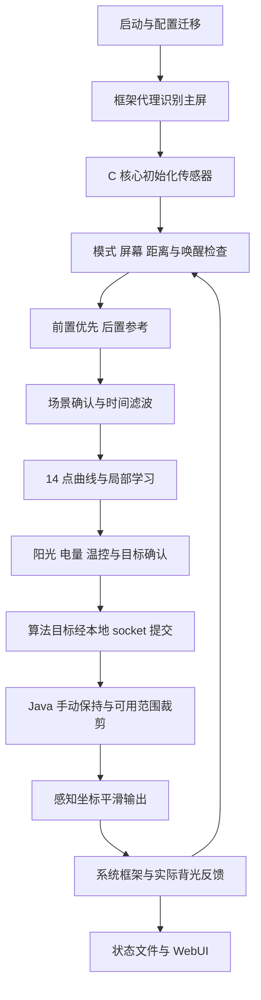

# LumaCurve 项目结构与代码逻辑审查

审查日期：2026-09-30。范围：当前工作树、正式 1.0.0 交付包、自动适配候选版，以及核心、框架输出、安装升级、WebUI、网站与验证入口。

本轮只新增审查文档和可复现工具，没有修补运行代码、重新打包、提交或推送。已存在的自动适配改动保留。下文明确区分直接复现、静态调用链证据和需要实机验证的事项；没有把主机测试当成手机验收。

## 1. 总体判断

项目已经是能够独立构建和维护的源码工程；当前调光的主路线也已从直接抢写 sysfs 转为系统显示框架临时亮度接口。它能够实际调光，不是只有监控功能。

但是，代码目前存在跨层状态和优先级缺口，不能根据“请求接受”“进程运行”“安装预检通过”推导持续控制成功。尤其需要先处理手动保持与温控的冲突、反馈不收敛的检测、远程更新脚本的执行权限，以及自动适配对坐标映射的假设。

现路线是在系统自动亮度仍运行的情况下，以临时框架亮度覆盖输出。系统继续提供亮度范围、温控、HBM、窗口覆盖和屏幕状态等约束。它并没有把 HyperOS 的整条自动亮度链路删除或完全接管。产品表述应使用“接管主屏自动调节输出”，不要承诺完全替换厂商显示策略。

## 2. 三份状态必须分开

| 对象 | 本轮确认的状态 |
| --- | --- |
| 正式包 `dist/luma_curve-1.0.0.zip` | 保留原包；`framework_release.py` 验证包、网站下载、源码包及更新元数据一致 |
| 当前源码工作树 | 包含未提交的 capability 自动识别改动；不是正式包内容的完全等同副本 |
| 本地候选包 `dist/luma_curve-1.0.0-local-framework-adapt01.zip` | 自动识别显示接口与候选坐标；17Ultra 实际输出尚未验证；不应直接同步为正式下载 |

正式包 SHA-256：`0a6d69a8169ac258ba343decf16f9f65271551a849658cfc0311e892eeac8e04`。

候选包 SHA-256：`8229498d9aa2a7bad07774d0ecc41208658351695f5143bebe20ba1655c8d23d`。

版本号同为 1.0.0，定位问题时必须同时记录 `core_build` 和包的哈希。GitHub 仓库私密状态与代码运行无关，但普通用户不能依靠私密仓库获得更新和源码；官网是否已部署不能由本地同步测试证明。

## 3. 工程结构和真实入口

| 部分 | 入口/文件 | 职责 |
| --- | --- | --- |
| C 业务核心 | `csrc/main_business.c` | 启动、模式边沿、屏幕/唤醒、光感选择、滤波、目标、保护、调度与退出 |
| 状态与平台边界 | `state.c`、`state.h`、`domain_io.h`、`platform_native.c` | 命名状态、系统调用、文件读写、框架后端适配 |
| 传感器 | `business_sensor_init.c`、`poll_sensors.c`、`set_light_sensors_enabled.c` | NDK 初始化、按事件顺序读取、启停与动态速率 |
| 场景/目标 | `business_debounce.c` | 双侧关系、单侧确认、安静传感器的时间滤波、目标滞回 |
| 曲线/学习 | `curve_pct_for_lux.c`、`brightness_preference.c` | 14 点曲线、局部缓慢学习、保存与恢复 |
| 保护 | `business_thermal.c`、`business_sunlight.c` | 可信温度、极端限亮、阳光条件与退出 |
| C→Java | `experimental/framework_output/framework_backend.c`、`framework_protocol.h` | Root 本地 socket、控制权、目标、心跳与反馈 |
| Java 输出 | `LumaFrameworkOutputBroker.java`及 Session/Ramp/Lease/Feedback/SliderOverride | 框架读取、临时输出、平滑、手动保持、租约和释放 |
| 自动识别 | `LumaFrameworkDeviceProfile.java` | HyperOS 4、主屏、背光节点、XML 候选映射、接口预检 |
| 安装/持久化 | `module/customize.sh`、`compatibility.sh`、`upgrade_data.sh` | 冲突检测、安装暂停归属、事务备份、迁移、回滚 |
| 服务与控制 | `service.sh`、`daemon_launcher.sh`、`framework_daemon_launcher.sh`、`luma_curvectl.sh` | 启动整组进程、监督、暂停/恢复/重启、日志与重载 |
| WebUI | `module/webroot` | 四页界面、Root 桥、曲线与预设、配置保存、更新提示 |
| 静态官网 | `website`，同步到 `D:\IOS\web` | 介绍、模块/源码下载、更新数据、感谢名单 |
| 构建 | `build_framework_probe.py`、`build_framework_module.py` | 当前框架版 Java 和 C 产物 |

`experimental/framework_output` 虽然名称含 experimental，已经参与当前框架版生产构建。目录名不能再作为“不会影响正式版”的判断依据。

## 4. 正常运行的控制链

关键坐标不是一种：lux 是环境照度；曲线百分比主要表示历史背光代码比例；C target 是节点整数代码；框架目标是 float；Java ramp 在 BrightnessUtils 的感知坐标中匀速推进；实际面板代码再由系统反馈。图上的 50% 不能自动解释成 50% nit，也不等同于系统滑块中点。

Java ramp 当前使用每秒 0.04 的感知坐标步进，单次时间积分最多 200ms，防止进程长时间停止后一次跳到目标。这是“感知坐标均匀”，不是 nit 线性或节点整数线性。其视觉效果是否符合预期需要设备测试。

## 5. 模式、屏幕与手动调整

- 手动模式：模块释放框架临时输出，交回系统；光感活动降低。
- 自动模式：C 计算目标，代理取得可用条件后输出；距离遮挡、窗口亮度覆盖、熄屏等条件会影响控制。
- 唤醒：存在观察窗口、采样确认和系统先调节阶段；此时并不持续强行锁定模块目标。安静的 on-change 传感器有专门真实缓存种子逻辑，不伪造第二个事件。
- 手动调整：代理观察 auto_brightness_adj 的变化，先释放 2500ms，让系统处理用户选择，然后捕获 adjustedBrightness 作为保持值。
- 保持退出：代理以传来的有效场景 lux 为参考，同时达到 `log1p` 比值约 3 倍和绝对差 8 lux，并持续至少 3 秒、多次调用确认；锁屏也清除保持。这些调用是目标/心跳，不等于多个独立光感事件。

双侧场景主要比较各自相对自身基线的方向，不直接平均两个 lux。相近时间内同向变化加快确认；前置单侧变化先等待；后置单侧变化通常不会替换有效前置输入。on-change 静默可保留有效值，避免“环境没变”被当作数值过期；代价是仅凭无事件无法区分稳定与事件流故障，需要额外健康信号。

## 6. 学习和持久化

当前新学习与原恢复代码的旧学习不是同一套机制。旧 `cfg_learn_enabled` 被关闭，但 `preference_learning` 默认开启。

新学习需要明确的主屏 `BrightnessEvent` 用户事件、自动模式、同一附近锚点、同方向多次调整；两次手势计数间隔至少 5 秒，最后调整后等待 8 秒，每次点高变化最多 0.25%，成功后 60 秒冷却。单点累计变化限于基础值的约 ±20%，同时受相邻点约束以保持单调。

这符合“很慢、局部”的要求。均值很平的自定义曲线有边界限制：若一个点左右都等高，单点学习可能被邻点夹死。属于当前设计能力边界，应向用户解释或以后通过邻点协调解决。

运行数据在 `/data/local/tmp/luma_curve*`；持久事务和快照在 `/data/adb/luma_curve`。存在原子替换、安装暂停归属、备份/迁移/回滚等防护，不能简单清空暂停文件或配置目录解决启动问题。

## 7. 按优先级排序的问题

### F00 · P1 · 设置来源字符串越界，直接破坏前置 lux

证据：`csrc/state.h:69` 的 `settings_read_source` 只有 16 字节，下一个字段是 `g_front_lux`。`refresh_settings.c:43` 向该数组复制 `framework_provider` 共 19 字节，越界 3 字节；数组内也没有结束符。

直接复现：编译并调用当前 `ios_settings_refresh` 的框架分支，仅模拟 RPC 和时钟，前置读数从 482.238 变为 128.447。该刷新周期约 500ms，因此正常 RPC 刷新也会重复损坏已缓存的传感器值。状态序列化读取该来源字符串时还有越过数组边界读取的风险。

影响：这是输入数据污染，不是光感真实变化；会干扰双侧关系、可信输入、安静样本、曲线和学习判断。它可能参与此前的照度显示/场景异常，不能在没有针对设备回放的情况下断言解释了所有异常。

处理：使用有界且明确终止的短标签；若扩容结构，要审查固定布局和全部 ABI 映射。增加生产框架分支测试：刷新任何设置不得改变 front/back lux、事件时间和计数。旧 settings 测试主要运行非框架分支，未覆盖该越界。

### F01 · P1 · 更新检查在 Root WebUI 内执行远程代码

证据：`module/webroot/app.js:125` 动态插入官网 `update.js`；同页面 `kernelsu.js` 将 Root exec 桥公开到 `window.KSU`，也可访问原 `window.ksu`。对版本和下载地址的检查发生在脚本已经执行之后。

影响：官网更新脚本若被篡改，会以模块 WebUI 的脚本权限运行，有机会调用 Root 桥。HTTPS 和回调数据校验不能把可执行 JavaScript 变成纯数据。

处理：更新使用纯 JSON；通过允许跨域的 fetch 或固定地址 Root 下载后仅 JSON.parse，不执行远端代码。限制域名、大小、超时、字段；下载包再校验清单。自动弹窗仍可以保留。

### F02 · P1 · 手动保持覆盖模块硬温控目标

证据：`LumaFrameworkOutputBroker.java:192` 对 C rawGoal 调用 `sliderOverride.apply`；该函数保持时直接返回 heldBrightness，随后只按框架 min/max 裁剪。RPC 没有携带模块温控 cap 或“保护必须优先”的标志。

直接复现：保持 .60，传入温控目标 .15，输出仍是 .60。本轮主机调用实际 SliderOverride 类得到此结果。对应 C 温控状态可能显示“正在限亮”，但代理未执行该上限。系统自身热保护仍可能生效，不能把这理解为系统热保护也被删除。

处理：把舒适目标、用户保持值和硬保护上限分开；最终目标先决定保持/自动，再统一裁剪到模块安全上限及系统范围。增加“手动保持 + 温控进入/退出”组合测试。

### F03 · P1 · 永远不收敛的框架反馈不会触发故障

证据：`LumaFrameworkMappingFeedback.java:8`、`LumaFrameworkOutputFeedback.java:10` 在 adjusted 不接近 request 时复位计时。反馈守卫仅在框架反馈已经跟上之后开始检查；最需要检测的“始终跟不上”反而不计时。

直接复现：request=limited=.50，adjusted=.10，node=1638，持续调用 60 秒；两套守卫均不报故障。C `framework_backend.c` 的 successes 统计 RPC 被接受，也不能补上物理执行证明。

处理：增加独立收敛期限，区分合理 ramp、系统明确限幅、反馈陈旧和真正不执行；超时后释放并报告原因，采用有限恢复，不无限重复提交。应单独记录“请求接受”和“实际达成”。

### F04 · P1 · 自动适配仍含未证明的换算和 OTA 延续假设（候选版）

证据：`LumaFrameworkDeviceProfile.java:69` 用旧 uniqueId+max 选择 17848；同 ID 的系统更新仍会使用旧比例，并在第 97 行跳过 XML 检查。其他设备用 max 作为比例；XML 只验证 value/nits 单调和归一化，不证明节点代码与框架 float 全区间线性。`plausible` 只核对一个当前样本，容差为 48 代码或 15%。

影响：低亮区一个样本通过，不能保证中高亮、不同显示模式或更新后的映射正确。每次启动重新识别接口也不意味着重新证明旧比例有效。当前 17Ultra 数据支持低区间候选推断，尚未证明输出。

处理：区分接口能力、映射能力和输出验收；记录实际加载配置及映射证据指纹。旧校准也需受证据版本约束。未知坐标不能因 XML 归一化就宣称全范围适配；先建立受约束的候选 profile 和实机反馈验收。

### F05 · P2 · HBM 节点设置在框架版没有可执行写路径

证据：`platform_native.c:169` 和 `:180` 拒绝写 `/sys/`；`highlux_deactivate.c`、配置重载和阳光辅助仍通过 fopen 写 HBM 节点。设置页仍提供“允许硬件高亮”、节点路径及开关值。

影响：硬件存在节点也不能通过当前这条路径开启。算法阳光目标提升与硬件 HBM 是两件事；框架范围仍由系统决定，不能据配置宣布 HBM 可用。

处理：框架版明确标记直接 HBM 不支持，移除/禁用无效设置；将来如果接入系统 HBM 能力，再独立验证，避免重新与系统策略争抢节点。

### F06 · P2 · 最终输出速度不使用设置中的升亮/降亮参数

证据：`LumaFrameworkOutputRamp.java:18` 固定 `.04f * dt`；目标协议只含序列、target、max、lux，没有升暗速度。框架版目标确认也跳过原生的分段阶梯。

影响：C 里可能仍使用这些配置参与旧计算/状态，但代理最终 ramp 的感知速度不会直接按用户选择变化；状态速率、设置说明与执行速度不是同一契约。

处理：只保留一处最终过渡器，让协议传递经过验证的双向速度和必要保护；分别测试 0.5/1/2.5 倍下实际 ramp 斜率。不要用两套 ramp 叠加补救。

### F07 · P2 · 启动失败后的兜底释放不检查是否曾拥有输出

证据：`framework_daemon_launcher.sh:30` 在 cleanup 无条件调用 Temporary release，后者发送主屏 temporary=NaN；即便代理识别失败、尚未输出，也会执行。

影响：可能清除其他应用刚建立的临时亮度；重启交接时，旧启动器的迟到释放也可能清除新实例输出。现有代理内部责任跟踪不能限制这个外部兜底调用。

处理：使用整组实例锁/代次；仅曾取得控制权的实例可做兜底释放，并确认没有新实例接管。释放重试和“从未取得控制权”需要不同处理。

### F08 · P2 · 构建入口与总验证已经分叉

证据：`CMakeLists.txt` 和 `tools/build.py` 仍只构建旧原生后端；`build.py --package` 可输出与正式框架包同名的 ZIP。当前框架版通过另一个脚本构建。`tests/verify_project.py:34` 还要求旧 GitHub updateJson，包清单也未适配 framework-broker/source 布局。

实际执行：正式交付验证通过；旧总验证在 service.sh 报告哈希绑定处失败。即便刷新这个报告，旧更新地址/构建产物假设仍需要修正。不能为了“全绿”删掉校验。

处理：明确唯一生产入口；旧后端必须使用独立目标与独立包名，禁止覆盖正式包。统一验证绑定当前生产 ELF、DEX、源码、安装脚本、前端及交付元数据。

### F09 · P2 · 配置校验和应用确认不完整

证据：`load_config.c` 对多数旧字段使用 atof/atoi，不检查尾字符；`fclose` 的结果未用于拒绝配置。WebUI 只等待文件回读和重载请求发送，没有等待 C 确认新配置生效。

直接复现：`brighten_speed=1junk` 被接受为 1。新增 curve/preference 字段校验较严格，但旧字段不一致。NaN 比较缺少统一 isfinite 属于静态风险；本轮 Windows CRT 的 nan 配置被转为无效范围并拒绝，不能把该结果当作 Android NaN 已复现。

处理：所有数值统一严格解析，检查有限值、完整字符串、范围及跨字段约束；错误保留上一份配置。增加配置 revision 的“已加载/已拒绝”反馈，让页面区分“已保存”“已应用”和“应用失败”。

### F10 · P2 · 诊断字段受功能开关影响，学习字段容易误读

证据：`write_state_file.c:274` 将 core_build、执行器及框架诊断置于 `indoor_stability || curve_custom || preference_learning` 条件内。关闭这三项，会隐藏与它们无关的后端诊断。旧 learn_block_reason 也与新 preference_learning 不对应。

影响：关闭可选功能后更难排障；用户可能看到“学习关闭”却实际新学习开启。代理 goal 还可能已经包含手动保持，字段名 algorithm_goal 容易把它误认为 C 原始曲线目标。

处理：后端身份、控制权、反馈时间、执行错误必须无条件发布；分别公布 C 原目标、保持目标、保护上限、系统限幅目标与实际值。新旧学习诊断明确区分或移除旧项。

### F11 · P2 · 配置和预设的并发保存仍存在窗口

证据：`app.js:670` 对原配置内容作比较后再 mv，没有覆盖整个比较→替换阶段的共享锁；预设使用同类流程。

影响：两份 WebUI 或配置迁移恰好在比较后写入，仍可能发生后写覆盖。原子 rename 能避免半文件，不能保证并发版本比较原子化。

处理：由控制脚本统一执行带期望 revision 的事务，并与迁移/恢复使用同一锁。现有“别人提前修改后保存必须失败”测试不等于验证了比较后的竞态。

## 8. 维护性与性能

### 补充 F12 · P1 · 覆盖升级没有等待整组框架输出退出并恢复稳定

补充证据：用户在旧核心运行期间安装候选版，安装进入第 3 阶段后，`LumaFrameworkDeviceProfile.main:131` 报 `live coordinate mismatch; calibration required`，安装回滚。该错误表示当时实际节点与 adjustedBrightness 的单次坐标检查未通过，不是 Root 管理器权限错误，也不等于设备永远不支持。

静态调用链：`customize.sh:35` 开始升级事务，`upgrade_data.sh:383` 的 quiesce 只检查 `luma_curve_daemon` 已消失，停止 service 后还会直接 chmod 节点并固定等待 1 秒；它没有等待旧框架启动器及 broker 退出，也没有确认临时覆盖已经释放。旧启动器发现 C 退出、代理 shutdown、dumpsys 释放确认和外部兜底可能仍在进行。新安装接着执行只读预检，立刻比较节点与 adjusted，无稳定等待或暂态原因区分。

结论边界：代码确实存在整组交接未完成即预检的窗口，截图验证了预检失败。没有失败瞬间的节点/框架读数，不能断言这次差异只由旧代理造成；真实坐标不匹配也会进入相同异常分支。

处理：升级事务暂停整组控制，等待旧 C、框架代理和启动器全部退出，确认临时覆盖释放；再以有界时间等待同一主屏反馈稳定，记录至少节点、adjusted、范围、时间、profile 和失败类别。不能靠取消坐标校验或无限增大容差让安装通过。失败回滚还应区分恢复了数据与恢复了旧服务运行，尊重升级前的用户暂停状态。增加“旧核心活动中覆盖安装”“过渡中升级”“代理释放较慢”“预检失败后旧版恢复”的组合测试。

主循环仍约 2400 行，混合了恢复出来的 goto、scratch 内存视图、十六进制常量与后续业务规则。它虽然不依赖原 ELF 构建，但不宜再持续把跨层新策略塞进此函数。下一步应按生命周期拆出状态转换，而不是再次整体重写失去验证基线。

Java 和 C 分别维护 ownership、目标、限幅、保持、transition，Shell 又维护存活状态。当前主要问题不是算法计算量，而是这三层尚未定义同一套状态契约。

性能可优化方向：代理非活动仍每 500ms 读取框架和三项 Settings；活动每 100ms 检查反馈；C 以新连接做 RPC，逐字节 recv；启动器每秒创建 sleep/检测循环；释放时同步执行最多 3 秒 dumpsys，并持有代理同步锁。这些开销值得测量和减少，但不能通过停止必要反馈换取“低 CPU”。

建议先区分活动/稳定/熄屏与事件驱动，再测各态 CPU、PSS 和唤醒次数。现有 README/官网已经使用整组 65–71MiB PSS、约 1.26% 单核的样本，没有继续把旧 C-only 的 30MB/0.02% 宣传为整包数据。本轮没有新的手机耗电数据。

## 9. 安装、升级和界面审查

有益设计应保留：显式源列表；可恢复的安装数据事务；暂停归属；Root socket 两侧 UID 校验；控制租约；窗口覆盖退出；原子持久文件替换；主屏与未知节点歧义拒绝；WebUI 标签 replaceState 而非逐次 pushState；本次开机日志筛选；本地静态源码下载；GPL-3.0 完整协议。

候选版安装预检已经明确写出 actual_output=unverified，不再把只读检测宣称为真实写入成功。它仍不验证传感器连续事件、实际显示输出或持续运行，安装文案必须保持这个边界。

界面合理性：状态页应展示“输入→场景→曲线目标→保持/保护→系统可用范围→实际”，当前虽已有有效目标字段，但保护与保持叠加时信息会互相矛盾。应优先修状态契约再修文案，避免用文字掩盖输出错误。

开源和下载：网站离线文件存在不等于域名上的更新地址可访问。本轮不检查网络部署，也不修改远端权限。开发说明仍写 0.0.1、配置 11、NOTICE 必须存在，而当前为 1.0.0、配置 12、NOTICE 已移除；应清理过期操作指导，保留实际来源与许可证记录。

## 10. 本轮验证结果

| 验证 | 结果及范围 |
| --- | --- |
| `build_framework_probe.py` | Java 主机组件测试与 DEX 构建通过；不是 Android Binder 实测 |
| `framework_core_selection.py` | 启动、目标、安静唤醒通过，3 个语义负向被拦截 |
| `framework_module_install.py` | 3 个安装边界模拟通过 |
| `brightness_preference.py` | 学习、意图、持久化通过，5 个负向拦截，201 个 C/JS 曲线样本一致 |
| `webui.cjs` | 使用已有 Playwright 和本机 Edge，46 项通过；不等于 KSU 真机桥测试 |
| `framework_release.py` | 原正式模块、源码、官网本地下载和更新元数据一致 |
| `verify_project.py` | 失败：service.sh 的既存报告哈希陈旧；另有旧构建/更新假设，不能宣称总验证全通过 |
| `audit_logic_20260930.py` | 复现框架刷新越界破坏 front_lux、手动保持覆盖温控目标、反馈不收敛无故障、旧 ID 自动沿用比例，以及带尾垃圾配置被接受 |

复现结果：`build/code-audit-20260930/reproductions.json`。复现工具编译真实 Java 辅助类和 C 配置代码，复用隔离 IO fixture，不读取或修改手机节点。

现有测试对局部滤波、学习和边界已有价值。主要盲区是生产组合：C 保护目标经过 Java 保持后的最终结果；Binder 接受但显示不执行；开关全部关闭时诊断是否仍有；旧实例清理与新实例取得控制权的交接；更新脚本与 Root 桥的信任边界；OTA 后校准证据失效。

## 11. 后续实施顺序和验收条件

1. 先修 F00/F01/F02/F03：输入越界、更新纯数据、保护优先、独立收敛故障；每项用本轮见证做回归和负向。
2. 统一输出契约：C 原始目标、手动保持、保护上限、最终有效目标、实际反馈、异常原因。让界面和日志使用相同概念。
3. 收紧自动识别：OTA 证据版本、未知映射处理、实际输出状态。已有设备与新设备独立验收，不用一个 ID 或一个低区样本替代整机型保证。
4. 修整组生命周期与配置事务：控制权代次、重启互斥、按责任释放、升级等待整组退出与反馈稳定、失败恢复旧服务、应用 revision 确认。
5. 统一构建/验证/文档：正式后端只有一个明确入口，旧后端独立包名；生产总验证不再引用旧报告和旧更新地址。
6. 最后优化性能和 UI：设置速度有真实执行效果，HBM 能力如实展示，减少后台唤醒并做各态实机采样。

下一正式构建的最低验收：手动保持不能越过模块硬保护；反馈长期不收敛能明确降级并有限恢复；锁屏/解锁循环无需手动重启；新旧实例不能互相清除输出；同一份源码能构建并验证对应 ELF/DEX/ZIP；安装能力与实际输出状态分开显示。满足这些后再扩大 HyperOS 4 固件覆盖。

## 12. 后续本地修复

上述表格描述审查时的状态，不能视为修复后的结论。2026-09-30 本地修复见《审查修复与本地测试包-2026-09-30.md》；原复现脚本现已转为回归见证，`reproductions.json` 记录当前修复验证。实机与未知固件的待验边界仍保留。
